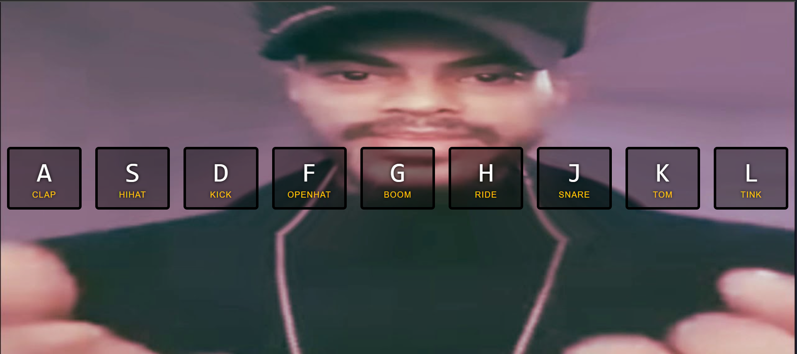

> This is a JavaScript practice with [JavaScript30](https://javascript30.com/) by [Wes Bos](https://github.com/wesbos) without any frameworks, no compilers, no boilerplate, and no libraries.

# 01 - Drum Kit

key event listener, audio play and toggle class.



<!-- view demo [here](https://amelieyeh.github.io/JS30/01-JSDrumKit/index.html) -->

<!-- ### ->main point ``` ```->code ``->highlight - ->bulleted point  -->

### Tricks

1.  `data-* attributes`

- instead using class and id and other standard attributes we can use it to store more info about an element for example.we knew now that this element corresponds to the key with ascii 72.

```
<audio data-key="72" src="sounds/ride.wav"></audio>
```

- To select such elements

```
   audio = document.querySelector(`audio[data-key="${e.keyCode}"]`);
```

2.  Audio tags have special methods like

```
audio.currentTime = 0;
audio.play();
```

3. instead of using setTimeOut which needs a synchronization between javascript and CSS to make
   time of it exactly like transition time

```
 transition: all 0.07s ease;
```

```
    setTimeout(function ()
         {
             key.classList.remove("playing");
         }, 77);
```

4.  we use transitionend which is a css event that is triggered when the transition is finished

```
key.addEventListener("transitionend", removeTransition);
```
