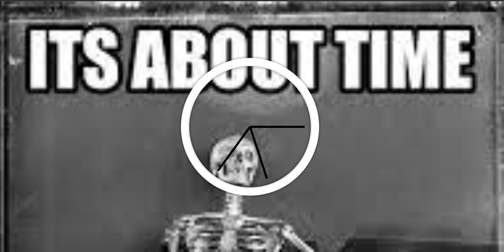

> This is a JavaScript practice with [JavaScript30](https://javascript30.com/) by [Wes Bos](https://github.com/wesbos) without any frameworks, no compilers, no boilerplate, and no libraries.

# 01 - Js and CSS clock

Analog clock made with HTML,CSS and JavaScript



<!-- view demo [here](https://amelieyeh.github.io/JS30/01-JSDrumKit/index.html) -->

<!-- ### ->main point ``` ```->code ``->highlight - ->bulleted point  -->

### Tricks

1. Transform origiin

the default of `transform:rotation` is to rotate from the origin`transform-origin: 50%` of the shape and in the case of a clock we want its hands to rotate from the right corner so we set `transform-origin: 100%`

2. To make transition like an analog clock as much as possible

```
   transition: all 0.05s;
   transition-timing-function: cubic-bezier(0.1, 2.7, 0.58, 1);
```

3. convert current (sec/min/hour) to degree

```
  const calcDegree = (time, max) => (time / max) * 360 + 90;
  //max->sec,min=60
  //max-?>hour->12
  //to get degree we get our percentage from max
  //+90 as we change default by 90 deg in css
```

4. we will call our updating function every 1 second as the fastest hand that needs to be updated is the second hand

```
 setInterval(setDate, 1000);
```

5. to update style of hands

```
      const secHand = document.querySelector(".second-hand");
      const secDeg = calcDegree(now.getSeconds(), 60),
      secHand.style.transform = `rotate(${secDeg}deg)`;
```
