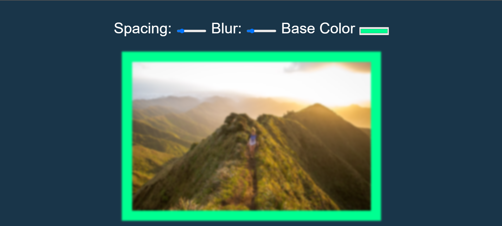

> This is a JavaScript practice with [JavaScript30](https://javascript30.com/) by [Wes Bos](https://github.com/wesbos) without any frameworks, no compilers, no boilerplate, and no libraries.

# 03 - Playing with CSS variables and JS

Analog clock made with HTML,CSS and JavaScript



<!-- view demo [here](https://amelieyeh.github.io/JS30/01-JSDrumKit/index.html) -->

<!-- ### ->main point ``` ```->code ``->highlight - ->bulleted point  -->

### Tricks

1. CSS variables vs SASS Variables

   - SCSS is a preprocessor. That means it is not CSS, but is converted into CSS at 'compile time'. In the resulting CSS code there is no resemblance to the original SCSS code. Hence you cannot change the variable values at CSS 'runtime'.
   - On the other hand you can do things with CSS variables that you can't do with SCSS variables like changing at runtime

2. Input of type color in HTML

   - If you want a color palette to change a color using it

3. NodeList vs Array
   ```
   let inputs = document.querySelectorAll(".controls input");
   ```
   - It returns a NodeList which not have all lovely array methods so in some situations we will convert it to array
4. dataset

   ```
     const suffix = this.dataset.sizing || "";
   ```

   - dataset returns an object that return all data-\* attributes of the element
